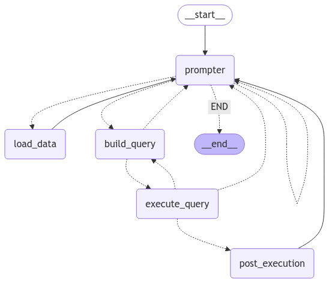

# SQL GPT

This tool provides an interactive experience for ask questions about your tabular data using AI to perform your SQL queries for you.
This repo software uses a multi-agent AI and SQL query engine to enable such experience.
You can simply load your data and ask questions about it.

This repository is designed to support various LLM services, as well as various SQL engines.

Currently, following AIs are supported:

1. OpenAI

Currently, following SQL engines are supported:

2. Duckdb

## Usage

Currently, this tool only provides a command line interface for interacting with your data.

To get started, install the python package with your desired SQL engine and LLM tools.
For instance, if you want to use OpenAI for query reasoning, and DuckDB for executing queries, install:

```bash
git clone git@github.com:pvaezi/sql-gpt.git
cd sql-gpt
pip install "sql-gpt[openai,duckdb]"
```

Now you can run the prompt tool in your machine:

```bash
export OPENAI_API_KEY=...
python -m sql_gpt \
    --llm openai \
    --llm-kwargs '{"model": "gpt-4o-mini"}' \
    --executor duckdb
```

Now you should see prompting tool available.
You can load one or multiple tables in your AI context, as shown in the example bellow:

```
>>> User prompt (/q to quit, /load to load data):
/load example_data/apple_sales_2024.csv example_data/apple_sales_2024_schema.txt
```

After data is loaded, you can start typing and asking questions from your data, e.g. `What are the top three states where apple sold most iPhones?` or `Given each region, give me the top state in each region that sold most iPads.`

You can exit program by typing `/q` at any time.

## Multi-Agent Design

This repository uses LangGraph to introduce a multi-agent AI behavior with human in the loop.



The core of the system includes a chat bot where user can interact with GenAI services to ask questions about their data.
Since LLM tools are great for text generation but has limitations for tabular data generation, we are using LLM to generate SQL queries that can be executed in the host environment, and interpret SQL results into natural language.

It includes two tool agents, one for loading the data, and another for executing SQL queries.
It also includes two LLM agents, one for building SQL queries, and one for interpreting the output of SQL query.
The loading of data includes loading column schema and proper description of each column, so that LLM can understand what each column means.

This LangGraph includes loop, where if user question is not understandable it will route clarification question back to the user.
Also if SQL query execution failed up to a certain limit LLM retries fixing its query.

## To Do

- [ ] Support other SQL databases.
- [ ] Support other LLMs including Llama.
- [ ] Handle context windows for long chats.
- [ ] Simple UI integration.
- [ ] Enable a more persistent storage for chat history.
